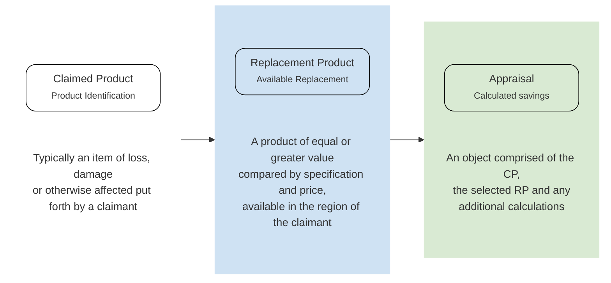

ValueChecker is a product appraisal service that includes product
identification and Like-Kind-and-Quality replacement suggestions.
Using advanced heuristic, matching and data analysis technology we are
able to provide superior and faster results than is humanly possible to
get using traditional web searching. We recommend you get in touch with
your ValueChecker contact person and request demo credentials for our
web GUI as the service concepts described below are presented there in
an intuitive manner. 

## Users and Policyholders
Users are normally the authenticated Claim Handlers / Adjusters who
interact with the ValueChecker API. Traditionally, they are doing so on
behalf of a third party (such as an Insurance company or a Claim
Handling company). In the case where the ValueChecker is being
implemented into a frontend solution (such as First Notice of Loss web
forms or mobile apps), the Policyholders are the `users`.

## Sequential Task FLow
The ValueChecker API is a wrapper on top of a robust system of data
aggregation, analysis, comparison and matching technology. To use this
system in its most powerful form and realize the maximum cost savings
this system can provide it should be used in a sequential manner. Each
subsequent action adds further value to the flow. 

## Claimed Product: CP
To deliver the bestLike-Kind-and-Quality replacement suggestions,
ValueChecker needs to know what is being claimed (lost, broken or
replaced for other reasons). The higher the level of accuracy in
describing or selecting the CP, the greater the precision in the
replacement suggestions. For the vast majority, every user action for an
individual product should always begin with a query to the [Product
Search endpoint](/api-reference/default/product_search).

### Core Categories
ValueChecker has a curated catalog for many products in the categories
of the most claimed products where we aggregate product attributes and
apply Product Naming logic. These categories are referred to as Core
Categories. They can include, and are not limited to (depending on the
market country):
* Phones
* Tables
* Laptops
* TVs
* Cameras
* Earphones & Headphones*
* Smart watches* 
* Dishwashers
* Washing machines
* Hobs
* Bikes
* GoPro's & Video Cameras

*Only popular brands

ValueChecker is capable of finding almost any standard product in a
majority of categories. The only difference is the higher accuracy and
correctness of the product information in the Core Categories. 

### Master Product
Master Products is a normalized group of products that are extremely
similar to each other. This usually accounts for product color
variations or other trivial deviations that make no difference to the
price or viability of the product as replacement candidate. If a claimed
product can be matched to one of these Master Products, ValueChecker
will return the product name by its non-attributive, normalized name
(i.e. _Samsung Galaxy S9 64GB (2018) instead of Samsung Galaxy S9 Dual
Sim 64GB Black_). When available, this name is in the /prices response
in the key: `grouped_prices.[0].[0].product.product_name` (0 and 0 being
the first (key) product of the first (row) group list in the
grouped_prices list for the lowest available price from a recommended
shop).

## Replacement Product: RP
At the heart of the ValueChecker service is our Replacement Product
technology. It calculates not only what would be suitable
Like-Kind-and-Quality replacement products for the claimed product
(using our internal product identifier, the `PID`) but also where it is
available for sale and at what price in the country of claim. The
[Replacement Product endpoint](/api-reference/default/prices) requires a
`PID` to perform these calculations.

## Appraisals
An Appraisal is a dataset of a CP, an RP and any calculations performed
on this pair of products. Calculations can be made on: 
* metadata attached to the Appraisal (such as date of purchase and/or
date of claim to calculate depreciation)
* metadata derived from the product (such as the category of CP, cost
value of the RP), or a number of manual metadata manipulations.

Appraisals can be grouped together in a cart with a specific Reference
that can be defined by your implementation (and/or the user). Appraisals
can have downloadable reports generated either at the Appraisal single
object level or group `cart` level (multiple Appraisal Objects).
